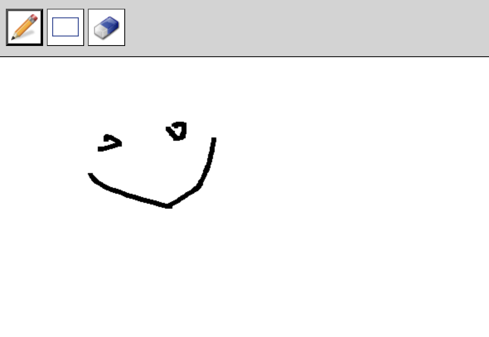

# Classkick Front End Engineering Take Home Project

## Intro
Welcome! and thank you for taking the time to complete the Classkick take-home challenge for our Senior/Staff Frontend Engineer position.

You will have a week to complete the project and expect to spend < 5 hours on it. Once you have completed your solution, please reply with a link to a forked GitHub repository or your folder with any helpful instructions for us.
If there's anything that you did not successfully complete, please add notes to your README section about what you could have done and reasoning behind the choices you made

## Motivation
At Classkick, our teachers and students LOVE using our [Canvas](https://developer.mozilla.org/en-US/docs/Web/API/Canvas_API/Tutorial) feature to create fun and engaging content.

This project emulates the type of scenarios we face at Classkick, with similar technical challenges regarding UI and real-time UX.

## Goal
Your task is to create a [Canvas](https://developer.mozilla.org/en-US/docs/Web/API/Canvas_API/Tutorial) element to:
- Create a `Drawing`
- Create a `Textbox`
- Add an `Eraser Tool`. The Eraser UX is left up to your design decisions. Here are 3 examples of how it could function, but you can design your own function as well.
    - The eraser acts like a smudge eraser.
    - When a user smudges over a line in eraser mode, that erases the entire line.
    - When a user points and clicks a line, it erases.

**[Bonus]**: Add other tools like Colors, Images, or something else!

## Requirements:
 - Exhibits SOLID design principles, good application architecture, and project organization.
 - Create components as you feel is best suited for your solution and feel free to use any libraries and explain why you chose those libraries
 - Your app does NOT have to be hooked up to a backend and thus it does NOT have to preserve state. If you do choose to persist state, or even integrate with a backend, it will be considred a bonus. However, you should still stub out the API calls that you would make to persist state.
 - It should be clear in your code and/or documentation on areas for eg:
    - Design/Technical decisions
    - Mocks/stubs a virtual API that could be injected to persist all actions on the canvas remotely (eg: Firebase)
 - Tests!

Just remember: when in doubt, treat this project as though you are about to submit it to your peers for a PR.

## Bonus:
- Make it accessible.
- Make it production ready.
- Stand up a backend in order to persist state.

## Styling Guidelines

## Mocks

## Setup Guide
[SETUP GUIDE](SETUP.md)

Good luck and if you have questions, please reach out to us at hiring@classkick.com

## I finished those functionalities
- Create a `Drawing`
- Create a `Textbox`
- Add an `Eraser Tool` as a smudge eraser

**[Bonus]**: Add other tools like Colors, Images, or something else!

